<!-- Верхний баннер -->

  

---
### 🌐 Contacts

  
  
  
  

---
### 👋 Hello!
Hi, my name is Ruslan. I'm an ordinary guy who enjoys AI engineering and LLM. I currently live in Moscow, but I dream of moving to California, USA, traveling with my family, kitesurfing, launching startups with YCombinator and working for the NYSE. I'm a bit of a perfectionist, but I try not to go to extremes)

My interests in research and activities:
- LLMs and Prompting
- AI and Context engineering
- Automatization and Product Management
- Entrepreneurship and Financial markets

In X (twitter) I share observations and best practices, in GitHub — long analyzes and tools.

---

---
### ⚡ Some numbers

  
   
  

---

  

  <b>If you liked my repository, please give me a star!</b> 
  I'm not a professional developer — I use LLMs and vibe-coding. 
  Your support helps me grow and feel satisfaction from the work done.

  

  

